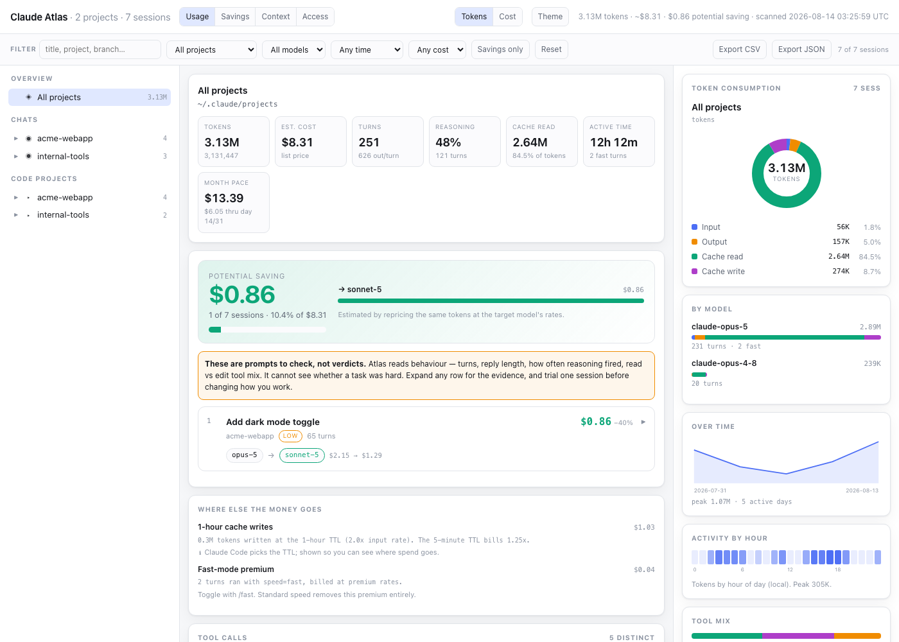

# Claude Atlas

Folder-structure navigation for your Claude **chats** and **code projects**, with a
right-side panel visualizing how each Claude model is consuming tokens.



*All data above is synthetic — generated by `dev/generate_demo_screenshot.py`
against fake sessions, never a real account. See [Screenshot](#screenshot) below.*

## What this is (and the one thing it can't be)

Claude Code plugins are made of commands, agents, skills, hooks, and MCP servers.
**None of those can draw a persistent panel inside the terminal window** — plugins
cannot modify Claude Code's UI chrome. So the right-side token panel lives where it
can actually exist:

| Surface | What you get |
|---|---|
| **HTML dashboard** (`/atlas`) | Three-column layout: nav tree on the left, detail in the middle, **token panel pinned right**. This is the real deliverable. |
| **Terminal report** (`/atlas-tokens`) | Same numbers, rendered as bars in the terminal. |
| **Statusline** (opt-in) | One live line in Claude Code showing the current session's tokens, cache hit rate, and cost. |

Everything reads your local `~/.claude/projects/*.jsonl` transcripts. Nothing is
uploaded anywhere.

## Install

```bash
/plugin marketplace add sreenichinthakunta/claude-atlas
```

```bash
/plugin install claude-atlas@sreeni-plugins
```

Requires Python 3.9+ (standard library only — no pip installs).

## Commands

| Command | Does |
|---|---|
| `/atlas` | Build the dashboard and open it (static file). |
| `/atlas-edit` | Start the local server so memory files are editable in place. |
| `/atlas-tokens [model\|project\|session]` | Terminal breakdown with bars. |
| `/atlas-savings` | Cheaper-model suggestions + non-model cost levers, in the terminal. |
| `/atlas-tree [project]` | Folder structure + sessions for one project. |

The dashboard has four tabs: **Usage** (the original nav + charts view),
**Savings**, **Context**, **Access**.

## Context — MCP servers and memories at a glance

Everything Claude Code already tracks locally, in one place:

- **MCP servers** — name, scope (user/project), transport, and which env vars
  it expects (values are never shown — only presence and a secret-like flag)
- **Project trust** — every directory Claude has been granted trust in, with
  allowed-tool and MCP-server counts, and whether the path still exists on disk
- **Memories** — every file under each project's `memory/` directory, with
  description, size, and `[[links]]` between them (including dangling ones)
- **Credential scan** — every memory file and global `CLAUDE.md` is scanned
  for patterns that look like leaked API keys, tokens, or private key blocks.
  Atlas never reads back or displays the matched value — only the file, line
  number, and which pattern matched, so you know what to rotate.

Static `/atlas` shows this read-only, embedded at build time. `/atlas-edit`
makes memory files **editable in place** — a `file://` page can't write to
disk, so editing needs the local server. Every save keeps a `.bak` of the
previous version.

## Access — what Claude is allowed to do

Reads every settings layer that applies on this machine — managed org policy,
user settings, and each project's `.claude/settings.json` /
`settings.local.json` — and shows the effective picture: allow/deny/ask rules
grouped by tool, trusted directories, hooks (which run automatically, so
they're listed as code you should trust), and enabled plugins.

It also flags things worth a look: allow rules with no matching deny rules,
no deny rules configured at all, an unusually large trusted-directory count.
These are observations, not a security scan — read them, don't just trust them.

## Finding cheaper-model opportunities

Atlas scores each session on four observable signals — turn count, average
reply length, how often reasoning was engaged, and read-only vs edit/exec tool
mix — then flags sessions that look routine **relative to your own work** and
computes what they'd have cost on Sonnet or Haiku.

**What it cannot do:** judge whether a task was actually hard. It sees
behaviour, never answer quality. So the design is deliberately conservative:

- **Hard disqualifiers first.** Sessions with heavy edit/exec activity are
  never suggested, regardless of how they rank.
- **Reasoning is judged relative, not absolute.** Adaptive thinking fires on
  most Opus turns by default, so an absolute threshold would either flag
  everything or nothing. Atlas compares against your own median.
- **Every reason must be true.** A suggestion only appears if a claim like
  "72% read-only tool use" is literally supported by the metrics. If nothing
  truthful can be said, no suggestion is made.
- **Confidence is shown.** `high` = three independent signals; `low` = one.
  Low-confidence rows are often wrong — trial one before changing anything.

If you get no suggestions, that's a real result: reasoning-heavy agentic work
genuinely needs a frontier model.

Each card has a **Copy switch command** button. It copies `/model <target>`
to your clipboard — nothing is changed automatically. Atlas has no way to
know a suggestion is right for your next task, so acting on it is always a
decision you make, not one it makes for you.

### Cost levers that aren't model choice

Often the bigger lever. Atlas separates **actionable** from **informational**:

- **Fast-mode premium** — turns recorded with `speed=fast` bill at roughly
  double. Actionable: toggle with `/fast`.
- **Cache write TTL** — 1-hour writes bill at 2× the input rate vs 1.25× for
  5-minute. Claude Code picks the TTL, so this is informational, but it is
  frequently the single largest line item and worth seeing.
- **Cache hit rate** — long-lived sessions cache better than many short ones.

## Filters

The filter bar drives **every** metric, not just the table — the KPIs, all
right-panel charts, and the savings list recompute from the filtered set.

Search (title / project / branch / model) · project · model · time range
(7/30/90 days) · minimum cost · savings-only · reset.

**Export CSV / Export JSON** export exactly the sessions the filter bar is
currently showing — useful for sharing a slice with a team without giving
anyone access to the raw transcripts or running anything through a server.

## The dashboard

**Left — navigation.** Two trees: *Chats* (project → session, each with its token
count) and *Code Projects* (the actual on-disk folder structure). Twisties expand
without changing selection, so you can browse and compare.

**Middle — detail.** Sortable tables of projects / sessions / tool calls. Rows are
clickable and drive the right panel.

**Right — token consumption.** Updates with whatever you select:

- composition donut (input / output / cache read / cache write)
- per-model bars, each internally stacked by component
- usage-over-time area chart
- cache hit-rate meter

The KPI row also includes **month pace** — spend so far this calendar month,
linearly projected to month-end. It only appears once at least 2 days of
data exist in the current scope; a 1-day sample is too noisy to project.

### The Tokens ⇄ Cost toggle matters more than it sounds

On a real workload, cache reads are typically **~97% of all tokens** — a raw token
chart is one giant slice that tells you nothing. Cache reads bill at ~0.1× the input
rate, so the *cost* picture is completely different. On the scan used to build this:

| | share of tokens | share of cost |
|---|---:|---:|
| Cache read | 96.7% | 66.2% |
| Cache write | 3.1% | 26.8% |
| Output | 0.2% | **6.9%** |
| Input | <0.1% | 0.1% |

Output is a rounding error by token count and a meaningful line item by cost. Flip
the toggle before drawing conclusions.

## Statusline (optional)

Adds a live readout of the **current** session. In `~/.claude/settings.json`:

```json
{
  "statusLine": {
    "type": "command",
    "command": "python3 ~/.claude/plugins/marketplaces/sreeni-plugins/plugins/claude-atlas/scripts/statusline.py"
  }
}
```

Renders as:

```
⛁ 3.5M  ↑405.4K  ↓36.6K  ⚡88%  ▁▁▇▂  ~$5.00  · Opus 5
```

total · input+cache-write · output · cache hit rate · composition bar · est. cost · model.
It prints nothing on any error rather than corrupting your status bar. Confirm the
path above matches where the plugin actually installed.

## Pricing and cost accuracy

Every dollar figure is an **estimate**, not a bill. Rates live in `pricing.json`
(USD per million tokens) and are read at scan time — edit freely.

Atlas prices three things most token counters get wrong:

- **Cache writes by actual TTL.** Transcripts record the `ephemeral_1h` /
  `ephemeral_5m` split. 1-hour writes bill at **2.0×** the input rate, 5-minute
  at **1.25×**. Assuming a flat 1.25× understated real spend by ~18% on the
  author's own data, where 100% of writes turned out to be 1-hour.
- **Fast mode.** Turns with `speed=fast` use the model's premium rates
  (Opus 5 / 4.8: $10/$50 vs $5/$25).
- **Unknown models** fall back by tier (`opus` / `sonnet` / `haiku`) rather
  than silently costing zero.

Cache reads bill at `cache_read_multiplier` (0.1×). Legacy model rates are
best-effort; current-model rates are list prices and will drift when Anthropic
changes pricing.

## Implementation notes

Two things here are easy to get wrong, and both were verified against real transcripts:

- **Usage blocks are duplicated.** Claude Code writes one assistant record per
  content block, each carrying an *identical* `usage` object. Summing them naively
  inflates totals — measured at **1.8×** on a sample transcript. The collector
  de-duplicates by `message.id`.
- **A session's `cwd` is not stable.** Transcripts record whatever directory the
  session was in at the time; one real transcript here held five distinct values
  (worktrees and `/tmp` checkouts). Taking the first-seen value mislabels the
  project, so the collector takes the *modal* value pooled across the project.

Performance: ~500 MB of transcripts scan in about **1.5s**, because lines are
filtered by cheap substring checks before any JSON parsing, and records above
500 KB are never parsed (a multi-megabyte tool result can contain the literal
text `"usage"` without being an assistant record).

## Testing

```bash
python3 -m unittest discover -s tests -v
```

Stdlib `unittest` only — no pip install needed to run them. Coverage: the
cost math (including the cache-TTL split and fast-mode pricing), transcript
parsing (message-id dedup, modal cwd resolution), the recommender's
disqualifiers and reason-truthfulness, the secret scanner (both catches and
false-positive avoidance), and the memory-edit server's path-traversal guard.
Several tests are direct regressions for bugs found while building this —
each says so in its docstring.

## Screenshot

`docs/screenshot.png` is generated by `dev/generate_demo_screenshot.py`,
which builds synthetic transcripts, runs them through the real `collect.py`
pipeline, and renders the dashboard with `--demo` (see below). No real
account was used. Regenerate it with:

```bash
python3 dev/generate_demo_screenshot.py --out /tmp/demo.html
# then screenshot /tmp/demo.html however you like, e.g. headless Chrome:
#   google-chrome --headless --window-size=1400,1000 --screenshot=docs/screenshot.png file:///tmp/demo.html
```

### The `--demo` flag

`dashboard.py --demo` swaps the embedded Context/Access data (MCP servers,
memory files, permission rules) for a small fictional placeholder instead of
this machine's real state. Useful any time you want to share a dashboard —
a screenshot, a demo, a bug report — without also sharing your real MCP
config, memory file names, or permission rules. Usage data (tokens, cost,
sessions) is unaffected; pair it with a redacted `--data` file if you need
to hide that too.

## What's deliberately not built

Two things came up as natural next steps and were left out on purpose:

- **Auto-switching models or capping spend.** Atlas is a read-only reporting
  tool. Automating a model change or refusing to let a session continue past
  a budget would mean trusting a behavioural heuristic with money and with
  whether your work continues — the same reasoning that keeps the savings
  suggestions advisory-only. The copy-switch button is the deliberately
  manual middle ground.
- **Cloud sync or a team dashboard.** That would mean a server holding your
  prompt history, which is a materially bigger trust ask than a local
  reporting tool. CSV/JSON export covers the "share with my team" case
  without introducing one.

## Layout

```
plugins/claude-atlas/            (what actually ships to users)
├── .claude-plugin/plugin.json
├── commands/          atlas.md · atlas-edit.md · atlas-tokens.md ·
│                       atlas-savings.md · atlas-tree.md
├── scripts/
│   ├── collect.py      transcripts + file tree → JSON
│   ├── inspect_env.py  MCP servers, memories, permissions → JSON
│   ├── dashboard.py    JSON → self-contained HTML
│   ├── server.py       local server: memory editing + rescans
│   ├── report.py       JSON → terminal bars
│   └── statusline.py   live current-session line
├── tests/               unittest suite -- see Testing below
├── docs/screenshot.png  synthetic-data screenshot for this README
└── pricing.json

dev/                              (repo-only, never installed)
└── generate_demo_screenshot.py  builds the synthetic dashboard above
```

`collect.py` is usable on its own if you want the raw data:

```bash
python3 scripts/collect.py --out usage.json
```
